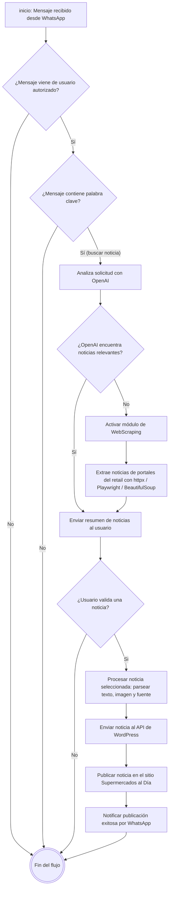

# Bot de WhatsApp para Supermercado al dia

## Objetivo:
 - generar un bot para poder obtener noticias importantes del mundo del retail, con el objetivo de recopilarlas y entregarlas por WhatsApp, para que se realice un filtro de noticias a travez de intervencion humana, para la toma de desiciones de subida de contenidos automaticos a la pagina de Supermercados al Dia.

## Flujo del Proyecto

## Herramientas a utilizar:

| Herramienta / Tecnologia                    | Rol en el Proyecto                 | Descripcion / Librerias recomendadas                                                                                                               |
| ------------------------------------------- | ---------------------------------- | -------------------------------------------------------------------------------------------------------------------------------------------------- |
| Evolution API                               | Comunicacion con WhatsApp          | API que gestiona envio y recepcion de mensajes, imagenes y audios. Se aloja en el VPS usando Docker y Nginx. Puede usarse por WebSocket o Webhook. |
| Python 3.x                                  | Lenguaje principal                 | Controla toda la logica, flujo de decisiones, integracion de APIs y automatizacion.                                                                |
| FastAPI                                     | Backend principal                  | Framework rapido y moderno para crear APIs REST y manejar WebSockets. Ideal para recibir mensajes desde Evolution API y responder en tiempo real.  |
| httpx                                       | Cliente HTTP asincrono             | Permite realizar peticiones concurrentes y eficientes a APIs externas y durante el WebScraping. Alternativa moderna a requests.                    |
| Playwright / Requests-HTML / BeautifulSoup4 | WebScraping                        | Extraen noticias de sitios del retail. Playwright para sitios con JavaScript, Requests-HTML o BeautifulSoup para HTML estatico.                    |
| OpenAI API (GPT-4o / Whisper)               | Procesamiento de lenguaje y audios | GPT-4o analiza mensajes, genera contexto y busca noticias. Whisper convierte audios en texto para su posterior analisis.                           |
| WordPress REST API                          | Publicacion automatica             | Permite subir noticias e imagenes directamente desde Python.                                                                                       |
| PostgreSQL o SQLite                         | Base de datos interna              | Guarda usuarios autorizados, logs de mensajes, resultados de scraping y estado de publicacion de noticias.                                         |
| SQLAlchemy                                  | ORM de base de datos               | Facilita la conexion y gestion de modelos con PostgreSQL o SQLite, manteniendo el codigo limpio y modular.                                         |
| VPS (Ubuntu Server)                         | Entorno de despliegue              | Servidor donde corren los servicios principales: Evolution API, FastAPI, WordPress y Nginx.                                                        |
| Nginx                                       | Proxy inverso y servidor web       | Redirige trafico HTTP/HTTPS hacia los servicios internos. Puede manejar certificados SSL con Certbot.                                              |
| Docker / Docker Compose                     | Contenedorizacion                  | Ejecuta Evolution API y otros servicios de forma aislada, simplificando despliegue y mantenimiento.                                                |
| PM2 (opcional)                              | Gestor de procesos                 | Util si el bot o backend se ejecuta fuera de Docker. Permite reinicio automatico ante fallos.                                                      |
| Logging (loguru / rich)                     | Monitoreo y depuracion             | Librerias Python para registrar logs coloridos y legibles con timestamps.                                                                          |
| Git + GitHub / GitLab                       | Control de versiones               | Administracion del codigo fuente, historial de cambios y posibles despliegues automatizados.                                                       |

## Instrucciones de ejecutado

 - En linux debes darle permisos de ejecución con el comando  `chmod +x update_docker.sh`
 - luego debes ejecutar el siguiente comando para iniciar el Docker Compose `./update_docker.sh` 