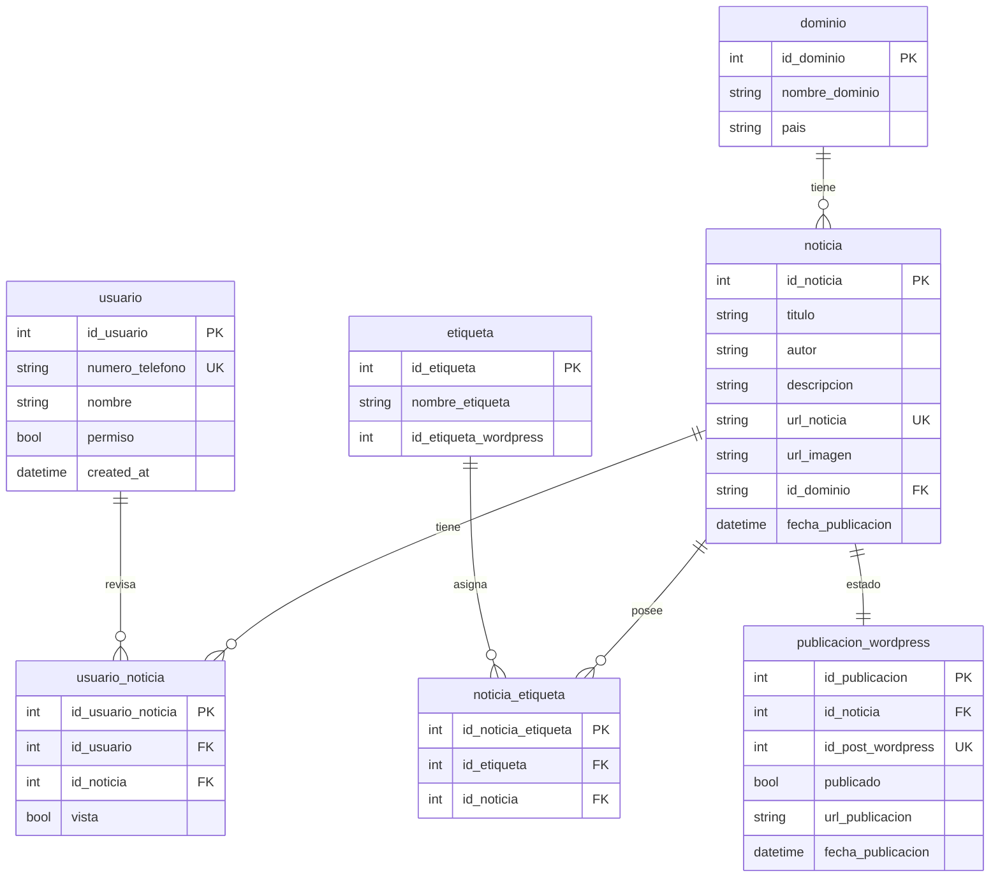

## Mermaid asignado para el proyecto
1) se busca obtener noticias (a través de [NewsAPI](https://newsapi.org/docs) obtendrás la documentación oficial de la api) relacionadas supermercados, retail de chile como en el mundo.

2) Una vez hecho la extracción de noticias, el usaurio debe decidir cual será publicada en el sitio [Supermercados al día](https://supermercadoaldia.cl) para que luego el agente realice la mejora de redacción y posteriormente subida al sitio.
***
representado de la siguiente manera:

## Dato importante
- los datos conciderados en el siguiente esquema entidad relación están pensados para interactuar con los diferentes requerimientos dentro del proyecto